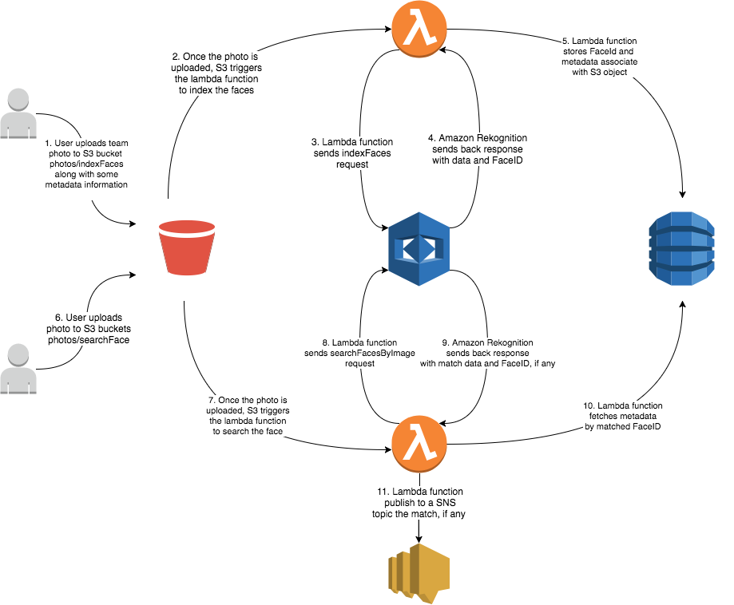

# Serverless Amazon Rekognition Sample
This repository contains a sample project that illustrates how to use the Amazon Rekognition services with a serverless architecture.




## AWS setup
Configure a KMS key that will be used to encrypt/decrypt the secrets handled by the service
1. login into your account console
2. go to IAM console -> Encryption keys
3. select the region you want to create the KMS key for
4. Click Create key
5. Type an Alias: i.e. <service name>-secrets
6. Add Key Administrators
7. Save changes

If you'd like CI/CD integration with `circleci` and perform automatic deployments of the service and all its dependencies in AWS, you need to create a `circleci` user. This user must have sufficient permissions to be able to access all the services shown in the diagram above. 

The AWS credentials associated to the `circleci` user need to setup in `circleci` (see below).


## `circleci` configuration:
#### AWS keys
**Access key ID** and **Secret Access Key** for the 
circleci user created above

#### environment variables
In the environment variables below with *xxx* we mean a deployment stage and can assume one of these values: `dev`, `qa`, `stage`, `prod`
- *xxx*_AWS_REGION: the AWS region the service will be deployed to for a specific stage *xxx*. For example: `dev_AWS_REGION`)
- *xxx*_AWS_ACCOUNT_ID: the AWS account ID the service will be deployed for for a specific stage *xxx*. For example: `dev_AWS_ACCOUNT_ID`.
- *xxx*_AWS_KMS_KEY_ARN: the AWS KMS ARN of the key used to encrypt/decrypt the secrets used by the service and its deployment for a specific stage *xxx*. For example: `dev_AWS_KMS_KEY_ARN`.
- *xxx*_SNS_EMAIL: the email address AWS SNS will send notifications to for a specific stage *xxx*. For example: `dev_SNS_EMAIL`.

## Secrets management 
Some of the environment variables used at runtime, represent secrets that need to be stored encrypted.

The `serverless` framework allows to read values that are stored in a specific bucket in AWS. We use this feature to store the secrets.

To manage secrets:
* make sure you have a S3 buckets that follows this naming convention: ratio-amz-rekognition-*stage*-secrets. For example:
  ```
  ratio-amz-rekognition-mylocal-secrets
  ratio-amz-rekognition-dev-secrets
  ratio-amz-rekognition-prod-secrets
  ```
* make sure you have defined STAGE, AWS_REGION and **_stage_**_AWS_KMS_KEY_ARN environment variables
* encrypt your secret by running the following command:
  ```
  npm run secret -- <secret> <s3 object name>
  ```
  For example:
  ```
  npm run secret -- my_super_secret servicePassword
  ```
  This command will use the AWS CLI to encrypt the given secret with the KMS key from env vars and create a new S3 object with the encrypted value in the S3 bucker above for the STAGE and REGION set as environment variables.

## Local development
You can test your changes in your own local environment on the cloud. 

To deploy to a local environment:
* make sure to have the environment variables described above configured in your system. For example you could create a file (remember to not check-in this file in Github) called `envars.local.sh` that contains the following environment variables:
```
// The stage you deploy the service to
export STAGE=mylocal

// The AWS region you deploy the service to
export REGION=us-west-2

// The service version
export SERVICE_VERSION=0.0.1

// The AWS profile that grants permission to deploy the service 
export mylocal_SNS_EMAIL=my.email@fakemail.com

// The AWS account ID you deploy the service to
export mylocal_AWS_ACCOUNT_ID=971089163844

// The AWS KMS ARN to encrypt/decrypt your local environment secrets
export mylocal_AWS_KMS_KEY_ARN=arn:aws:kms:us-west-2:xxxxxxxxxxxx:key/xxxxxxxx-xxxx-xxxx-xxxx-xxxxxxxxxxxx

// The AWS profile that grants permission to deploy the service 
export AWS_PROFILE=my-aws-profile
```
* To deploy the whole service make sure you're on the root folder of your service (i.e. `./server/`) and run: 
  ```
  npm run deploy:local
  ```
  
  This command will transpile your function's code, generate all needed scripts to provision your environment (with CloudFormation), package and upload your artifacts and finally will run the deployment on AWS by provisioning all the needed resources.

* To deploy a single function, run:
  ```
  npm run deploy:func:local -- <name_of_the_function>
  ```
  This will only transpile and deploy a single function and will be faster than the whole deploy command.

* To remove the whole service, run:
  ```
  npm run remove:local
  ```

To run unit tests:
```
npm run test:watch  // watch mode active
```
